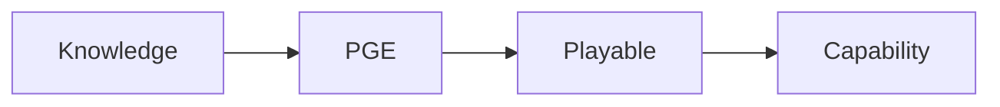

# Documentation Style Guide

> PlayableOS 文档规范（Documentation Style Guide）

> 本规范定义 PlayableOS 所有文档、概念、命名和编写方式。
>
> 所有产品文档、技术文档、PRD、设计文档均必须遵循本规范。

---

# 1. 为什么需要文档规范？

PlayableOS 并不是一个普通的软件项目。

它未来将包含：

- 创业文档
- 产品文档
- AI架构
- 技术规范
- PRD
- API
- Prompt
- Design System
- HTML Documentation
- 官网
- 开发文档

预计总文档数量将超过 100 份。

如果没有统一规范：

- 概念会重复定义
- 命名会越来越混乱
- AI 无法稳定生成内容
- 工程团队理解成本越来越高

因此，需要建立统一的 Documentation Standard。

---

# 2. Documentation Philosophy（文档哲学）

PlayableOS Documentation 遵循四个原则。

## Principle 1：Documentation First

先定义。

再设计。

最后开发。

任何功能，没有文档，不允许进入开发阶段。

---

## Principle 2：Definition Before Description

文档首先定义（Define）。

而不是介绍（Describe）。

错误示例：

> PGE 是一个很强大的 AI 引擎……

正确示例：

> PGE 是负责将企业知识转换为 Playable 的核心生成引擎。

---

## Principle 3：Single Source of Truth（SSOT）

任何概念，全仓库只能定义一次。

例如：

Playable

只能在：

21_PGE.md

进行正式定义。

其它文档只能引用。

不得重新解释。

---

## Principle 4：Markdown First

所有正式文档均使用 Markdown 编写。

Markdown 是唯一事实来源（Single Source）。

所有其它格式均由 Markdown 自动生成。

包括：

- HTML
- PDF
- Word
- GitBook
- Documentation Website

---

# 3. 文档语言规范

## 正文

全部使用中文。

原因：

目前主要阅读者包括：

- 创始团队
- 产品经理
- AI工程师
- 企业客户
- 投资人

全部为中文阅读环境。

因此：

正文统一采用中文。

---

## 专业术语

第一次出现：

采用：

中文 + 英文 + 缩写

例如：

> 可玩化生成引擎（Playable Generation Engine，PGE）

以后统一写：

> PGE

---

## 固定术语

以下术语全仓库统一，不允许出现多个版本。

| 中文 | 英文 | 缩写 |
|------|------|------|
| 可玩化 | Playable | — |
| 能力 | Capability | — |
| 场景 | Scenario | — |
| 机制 | Mechanic | — |
| 交互 | Interaction | — |
| 评估 | Assessment | — |
| 可玩化生成引擎 | Playable Generation Engine | PGE |
| 知识可玩化语法 | Knowledge Playability Grammar | KPG |
| 企业能力模型 | Enterprise Capability Model | ECM |

新增术语必须加入本表。

---

# 4. 文件命名规范

所有文件统一采用英文命名。

格式：

```
编号_英文名称.md
```

例如：

```
00_Company_Blueprint.md

10_Product_Whitepaper.md

11_Enterprise_Capability_Model.md

20_AI_Whitepaper.md

21_PGE.md

22_KPG.md

30_PRD.md
```

禁止：

```
产品白皮书.md

最终版.docx

新版2.md
```

---

# 5. 文档目录规范

```
docs/

00_Foundation/

10_Product/

20_AI/

30_Engineering/

40_Business/

50_Design/

60_Website/
```

所有文档必须放入对应目录。

---

# 6. Markdown Header

每个 Markdown 文件开头必须包含 Metadata。

格式：

```yaml
---
title:
id:
version:
status:
owner:
updated:
category:
---
```

示例：

```yaml
---
title: Playable Generation Engine
id: PGE-001
version: 0.1.0
status: Draft
owner: PlayableOS
updated: 2026-07-01
category: AI
---
```

---

# 7. 标题层级规范

统一采用：

```
#

##

###

####
```

禁止跳级。

例如：

错误：

```
#

###
```

正确：

```
#

##

###
```

---

# 8. 图片规范

Documentation 中原则上不保存图片。

统一采用：

- Mermaid
- SVG
- React Component

进行表达。

原因：

方便版本管理。

---

# 9. 流程图规范

统一使用 Mermaid。

例如：



禁止：

截图。

PPT截图。

流程图图片。

---

# 10. 表格规范

统一使用 Markdown Table。

例如：

| 模块 | 说明 |
|------|------|
| Parser | 解析知识 |
| Mapper | 映射能力 |

禁止：

Excel截图。

---

# 11. JSON规范

所有 JSON：

统一：

CamelCase。

例如：

```json
{
  "knowledgeType": "workflow",
  "playableType": "scenario"
}
```

禁止：

中文字段。

---

# 12. 代码规范

所有代码：

统一英文。

例如：

```typescript
interface PlayablePackage {

}
```

禁止：

中文变量。

---

# 13. 概念规范

任何专业概念。

只允许正式定义一次。

例如：

Playable

正式定义：

21_PGE.md

以后：

其它文档：

统一引用。

不得重新定义。

---

# 14. Mermaid 优先

所有架构。

统一：

Mermaid。

例如：

系统架构。

AI流程。

调用关系。

全部：

Mermaid。

---

# 15. Documentation Style

采用：

Apple

+

OpenAI

+

Anthropic

Documentation 风格。

特点：

- 极简
- 大标题
- 少废话
- 一句话定义
- 图优先
- 定义优先

避免：

长篇论文。

避免：

营销语言。

避免：

口号堆砌。

---

# 16. Commit 规范

所有文档采用增量提交。

例如：

Commit #001

完成：

Chapter 1

Commit #002

完成：

Architecture

Commit #003

完成：

API

禁止：

一次修改整个文档。

---

# 17. 版本规范

采用 Semantic Version。

例如：

```
0.1.0

0.2.0

0.3.0

1.0.0
```

规则：

Major

新增核心理论。

Minor

新增章节。

Patch

修复描述。

---

# 18. AI 协作规范

ChatGPT：

负责：

- 战略
- 产品
- 理论
- PRD
- Documentation

Codex：

负责：

- Repository
- HTML
- Documentation Website
- React
- Next.js

Cursor：

负责：

- Coding
- Debug
- Refactor

所有开发均围绕 Documentation 展开。

---

# 19. Documentation 生命周期

每份文档拥有四种状态。

Draft

↓

Review

↓

Active

↓

Deprecated

禁止长期保持 Draft。

---

# 20. PlayableOS Documentation 愿景

Documentation 不是项目附属物。

Documentation 本身就是产品。

未来：

Documentation 可以自动生成：

- 官网
- HTML
- PDF
- Word
- GitBook
- API 文档

Documentation 将成为 PlayableOS 的唯一知识源。

---

# Appendix A：命名规范

| 类型 | 示例 |
|------|------|
| Engine | PGE |
| Grammar | KPG |
| Model | ECM |
| Package | Playable Package |
| Agent | Knowledge Agent |
| API | GeneratePlayable API |

---

# Appendix B：一句话原则

> **所有开发，都必须先写文档；所有文档，都必须能够指导开发。**
