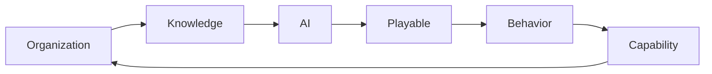
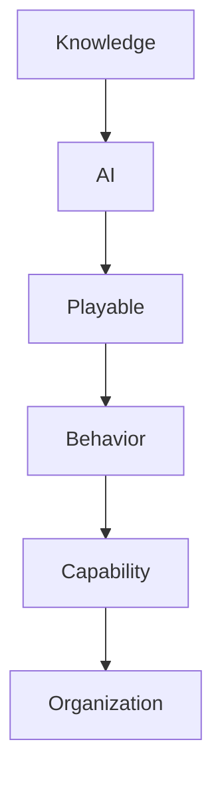

# PlayableOS Architecture

> PlayableOS 总体架构（Overall Architecture）

> 本文档定义 PlayableOS 的整体系统架构，是整个产品体系的最高架构文档。

所有 AI 系统、产品模块、技术模块均应遵循本架构。

---

# 1. 为什么需要 Architecture？

Architecture 不是系统框图。

Architecture 定义的是：

> **整个产品如何创造价值。**

所有模块都应该能够回答三个问题：

1. 我位于整个系统的哪个位置？
2. 我的输入是什么？
3. 我的输出是什么？

Architecture 的目的不是描述模块。

而是描述整个系统如何运转。

---

# 2. PlayableOS 的使命

PlayableOS 的使命不是建设一个学习平台。

而是：

> **帮助企业持续构建组织能力。**

知识只是起点。

能力不是终点。

真正的终点是：

> **组织持续成长。**

---

# 3. 整体价值流（Value Flow）

PlayableOS 的整体价值流如下：

```text
Organization

↓

Knowledge

↓

AI

↓

Playable

↓

Behavior

↓

Capability

↓

Organization
```

这是 PlayableOS 的核心飞轮。

每一次循环。

都会帮助企业形成新的组织能力。

---

# 4. 六大核心层（Six Core Layers）

整个 PlayableOS 被划分为六层。

```
┌─────────────────────────────┐
│     Organization Layer      │
├─────────────────────────────┤
│      Capability Layer       │
├─────────────────────────────┤
│       Behavior Layer        │
├─────────────────────────────┤
│      Playable Layer         │
├─────────────────────────────┤
│          AI Layer           │
├─────────────────────────────┤
│      Knowledge Layer        │
└─────────────────────────────┘
```

---

# 5. Knowledge Layer（知识层）

## 定义

Knowledge Layer 是整个系统的输入层。

负责承载企业所有知识资产。

这些知识包括：

- 企业文化
- SOP
- 产品资料
- 培训课程
- PPT
- PDF
- Word
- 视频
- 音频
- 客户案例
- 制度流程
- 管理经验

Knowledge Layer 不负责训练。

只负责：

> **沉淀企业知识。**

---

## 输入

企业知识。

---

## 输出

Knowledge Package

统一知识对象。

供 AI Layer 使用。

---

# 6. AI Layer（智能层）

## 定义

AI Layer 是整个 PlayableOS 的核心。

它负责：

> **把知识转换成能力训练。**

AI Layer 不是一个模型。

而是一组 Engine。

包括：

- Knowledge Parser
- Capability Mapper
- Scenario Engine
- Mechanic Engine
- PGE
- Assessment Builder

---

## 输入

Knowledge Package

---

## 输出

Playable Package

---

## 核心职责

AI Layer 回答五个问题：

这是什么知识？

↓

训练什么能力？

↓

放入什么场景？

↓

采用什么机制？

↓

如何评估？

---

# 7. Playable Layer（可玩化层）

## 定义

Playable Layer 负责承载所有训练体验。

Playable 不等于游戏。

Playable 是：

> **可参与、可互动、可训练、可评估的体验。**

Playable 可以包括：

- AI 对话
- 情景模拟
- 剧情挑战
- Boss Battle
- 流程闯关
- 模拟经营
- 多人协作

---

## 输入

Playable Package

---

## 输出

Behavior Data

---

# 8. Behavior Layer（行为层）

## 定义

Behavior Layer 负责记录员工行为。

传统 LMS 记录：

学习时间。

考试成绩。

PlayableOS 记录：

行为。

例如：

- 每一次选择
- 每一次决策
- 每一次沟通
- 每一次错误
- 每一次重试
- 每一次反馈

Behavior 是能力形成最重要的数据。

---

## 输入

用户行为。

---

## 输出

Behavior Data

---

# 9. Capability Layer（能力层）

## 定义

Capability Layer 负责分析能力成长。

它回答：

员工获得了什么能力？

能力是否提升？

能力还有哪些短板？

Capability Layer 不是考试系统。

而是：

能力分析系统。

---

## 输出内容

例如：

销售能力：

- 建立信任
- 需求洞察
- 产品表达
- 异议处理
- 成交推进

管理能力：

- 沟通
- 授权
- 决策
- 反馈
- 激励

最终形成：

个人能力画像。

---

# 10. Organization Layer（组织层）

## 定义

Organization Layer 是整个系统的最终目标。

所有能力最终汇聚成组织能力。

例如：

企业可以实时了解：

- 哪些能力最强？
- 哪些部门最薄弱？
- 哪些岗位需要训练？
- 哪些知识需要更新？

Organization Layer 不关注课程。

而关注：

组织竞争力。

---

# 11. Architecture Flywheel

整个系统持续运行如下：



飞轮每转一圈。

组织都会持续成长。

---

# 12. Layer Relationship



每一层只负责一件事情。

每一层都有明确输入与输出。

保持低耦合。

高内聚。

---

# 13. 系统边界

PlayableOS 不负责：

- HR 系统
- OA 系统
- ERP
- CRM
- 支付系统

PlayableOS 负责：

Knowledge

↓

Capability

这一条价值链。

其它系统均可通过 API 接入。

---

# 14. 模块归属

| Layer | Core Modules |
|--------|--------------|
| Knowledge | Parser / Knowledge Package |
| AI | PGE / KPG / Scenario Engine / Mechanic Engine |
| Playable | Playable Runtime / Interaction Engine |
| Behavior | Event Collector / Behavior Log |
| Capability | Capability Engine / Growth Report |
| Organization | Dashboard / Organization Analytics |

---

# 15. Architecture Principles

整个 Architecture 遵循以下原则：

- Layer First
- Low Coupling
- High Cohesion
- Engine Driven
- AI Native
- Data Driven
- Capability Oriented

---

# 16. Documentation Mapping

本 Architecture 文档是整个 Documentation 的地图。

后续文档位置如下：

```text
Knowledge Layer
│
├── Knowledge Theory
│
AI Layer
│
├── AI Whitepaper
├── PGE Specification
├── KPG Specification
│
Playable Layer
│
├── Product Whitepaper
├── Playable Library
│
Capability Layer
│
├── Enterprise Capability Model
│
Engineering
│
├── API
├── Database
├── Prompt
```

所有文档均应能够映射到本架构。

---

# 17. One Sentence

> **PlayableOS 不是一个学习平台。**

> **PlayableOS 是一个将企业知识持续转化为组织能力的 AI Operating System。**
