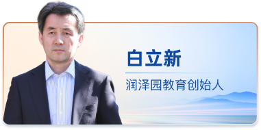
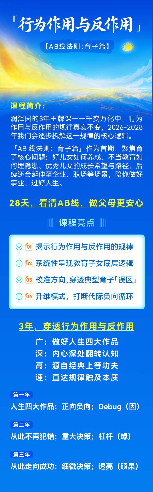
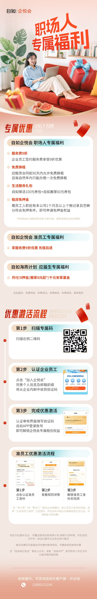
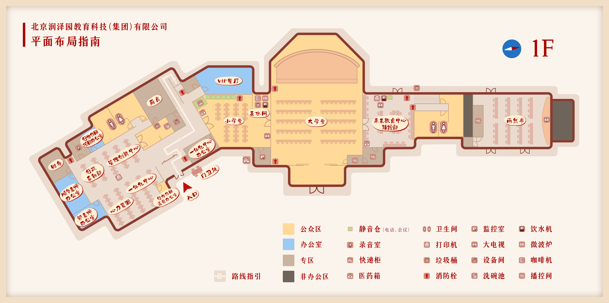
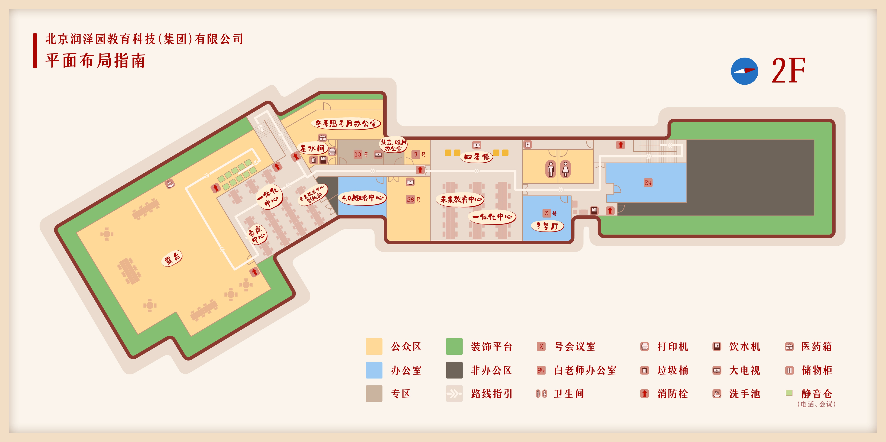
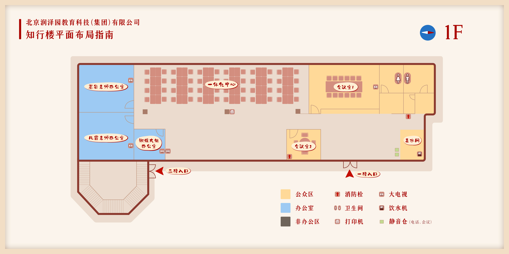
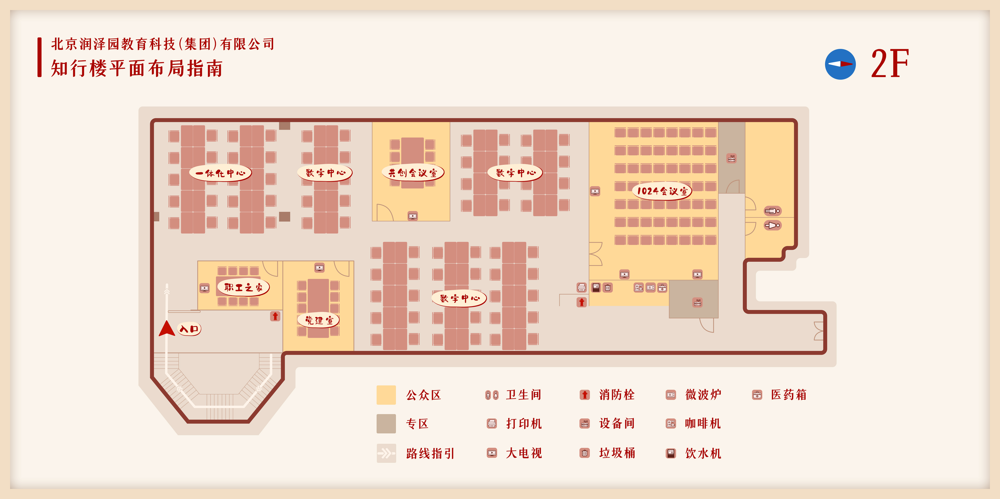
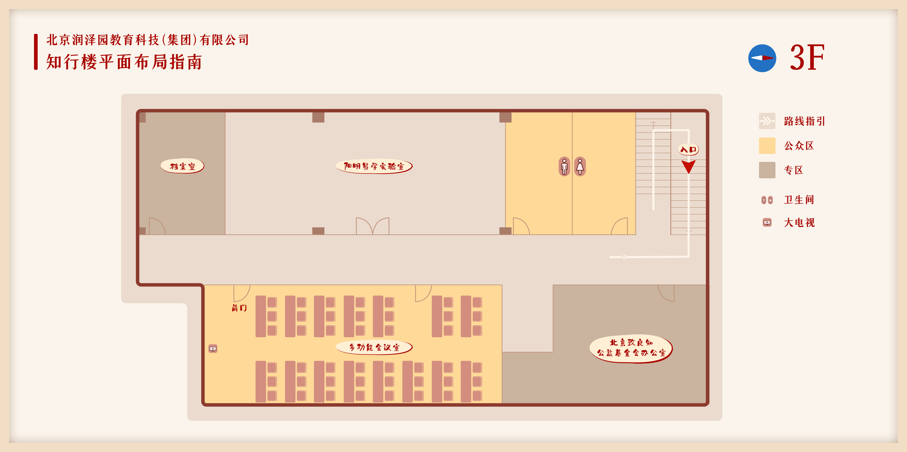
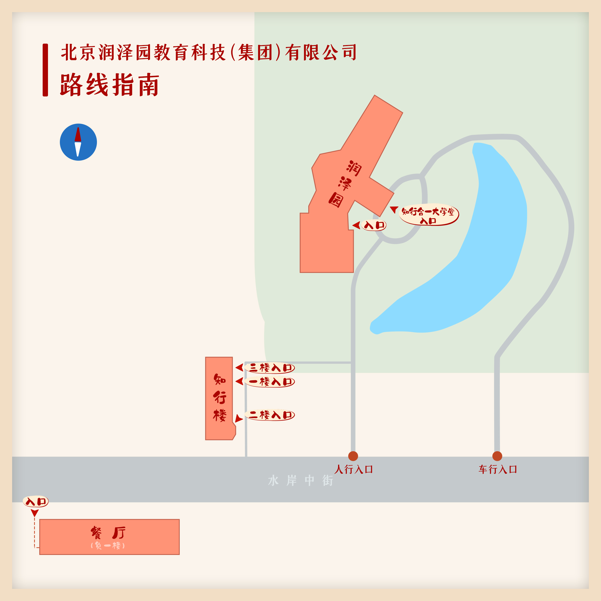
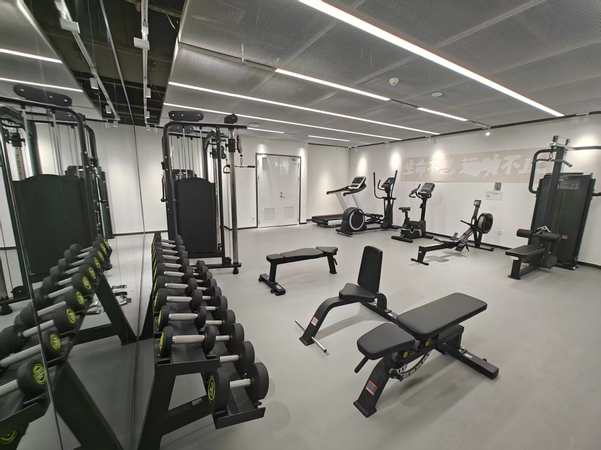

# 新员工入职指南\-欢迎加入我们！【持续优化版】

**Hi\~亲爱的新伙伴，欢迎加入润泽园大家庭！为了帮助你更快地融入公司与团队，让这份指南带你走进润泽园吧\~**

**内容包含：公司及部门介绍、新人任务、新伙伴学习内容、常用群组\&福利、制度须知、有问题该找谁等等……**

# 一、公司及部门介绍

> 北京润泽园教育科技（集团）有限公司（简称：润泽园教育），自2012年龙场发端以来，十三年静水深流，于心之根源处培壅灌溉，累计服务学员逾170万，致力于将中华经典创造性转化、创新性发展，助力企业战略创新、个人成长与家庭幸福。是一家创新型互联网教育机构。以助力企业战略创新为使命，持续推出以领导力为主题、以经营者为主体的课程体系。深耕企业服务的同时，在高等教育领域突破发展，已与美国索菲亚大学联合开办MBA商业哲学课程，并拥有全日制本科院校和博士后科研工作站。[润泽园官方介绍](https://jjsw3sn1v3.feishu.cn/docx/OT1IdWkyloi03bxqyWfcX7Dynuc?from=from_copylink)
> 
> 

**公司荣誉：**

「北京数字经济企业100强」、「北京市中小企业专精特新」、「国家高新技术企业」

**我们的使命：**助力企业战略创新

**我们的愿景：**成为企业家首选的教育品牌

**我们的价值观：**

人生重大秘密是心中拥有无尽宝藏

人生重大真理是行为作用与反作用

人生重大战略是建设自己心灵品质

人生重大价值是成就他人建设心灵品质

**我们期待你：**

**对自己，深沉厚重**

**对他人，深情厚意**

**对决策，深思熟虑**

**对经典，深入浅出**

在润泽园教育，有这样四个问题可以表达**初心与使命**：

**这是一个怎样的时代？**

**这个时代亟待解决的问题是什么？**

**如何修炼自己高尚的人格？**

**如何为我的祖国和人民效犬马之劳？**

## （一）组织架构

目前公司有6个中心\&事业部，你可以通过飞书\-通讯录，查看到公司组织架构和伙伴的联系方式

### **1、公司核心老师**

**白立新老师**

**郭红波老师**

**颜顺华老师**

**林若谷老师**

**顾兵老师**

**陈淑媛老师**

### **2、一句话了解各中心**

1. **求是中心：**负责推动一号战略的升级和落地，线上线下一体化服务广大中小企业，融入经典和商业，助力公司朝向互联网大规模运营。

2. **润泽中心：**1\.承接公司所有线上\+线下运营服务，制定品牌策略、市场推广课程销售及客户洞察体系，同时运营学历教育板块：MBA商学院课程、收购的两所本科院校的运营工作。聚焦在驱动业务增长与用户价值提升；2\.以中华优秀传统文化为根基，融合现代教育学、心理学等科学，助力企业打造“家庭幸福型企业”，提升员工幸福感与企业组织力，用幸福软实力成就企业硬实力；3\.以算力格物致知，令数据知行合一，在虚实之间映照天理，成万物互联之明德境界；4\.致力于为伙伴们提供一流的保障服务。既是公司服务保障部门，也是创新项目孵化部门。服务职能包括采购管理、档案管理、印章证照管理、印务管理、仓库管理、资产领用、安全管理、车辆管理、食堂管理、保安保洁、工程建设、审计、法务等。

3. **未来教育中心：**负责公司核心课程的研发以及大型线下线上学习会的举办，主要有战略领导力、领导力共创会、龙场训练营、鲲鹏训练营等。用内容和呈现为世界加分。服务范围：致28学员企业（百亿以上）、润泽1000学员企业（十亿到百亿）、中小微创企业全覆盖。

4. **财务中心：**负责公司的资金统筹、税务管理、财务核算和成本控制、系统流程管理，通过预算管理为业务决策和战略落地提供专业支持。严谨、守诺、专业、担当，管钱管账管流程，为业务保驾护航！

5. **管理创新中心：**目前主要负责的核心项目民企传承：服务企业营收在10\-100亿学员企业的企业传承和子女接班，产品主要有C50，E300等。还包括润泽日讲、阳明心学智慧开源、阳明心学课堂、道德经课堂、太太班等。

6. **心力资源中心：**企业人才战略的核心，负责选、用、育、考、留全周期管理，作为组织能量的源泉，通过激活个体心力潜能与团队认知提升（心智成长），打造润泽园特色组织文化，实现人与组织的共生成长，保障人才发展和公司目标的达成。

## （二）主要业务产品 及 我们的客户

主要业务产品分四部分：云课堂、线下课堂、高等教育、国际视野

### **1、云课堂**

### **2、线下课堂**

### **3、高等教育**

### **4、国际视野**

### **5、我们的学员企业**

# 二、新人任务\&应知内容

> 安顿好这些事情，才能更好地投入到工作中\~
> 
> 

## （一）须知篇

### **【高压线】**

**【高压线】**

**1、严禁发生婚外情，暧昧、出轨等有违道德行为，违者辞退；**

**❗❗❗****【禁止】未婚生育 【禁止】内部恋爱**

**2、严禁利用工作之便，向有关方面行贿（包括金钱或有价值的物品）/收取有关方面的贿赂，包括任何形式的回扣、佣金、红包等；或利用公司影响与其他公司交易，谋取个人、家庭成员、朋友利益的，违者辞退；**

**3、****严禁说谎及其他任何弄虚作假、有违诚信的行为****，违者辞退；**

**4、严禁透露自己工资给他人，违者辞退。**

1. **着装：**工作日需商务风着装。男士不留长发、不理夸张发型、不蓄胡须；女士不梳异型发、不化浓妆，首饰佩戴得体。夏季不穿露脚趾鞋子、短裤短裙，裙装需过膝。

2. **健康：**午休2h，午休文化；不定期周五晚有运动组织，可接龙报名参与。

3. **考勤：**公司实行标准工时工作制与不定时工作制并行的工时制度。标准工时制的工作时间为每周一至周五的8:00\-18:00，午餐和休息时间为12:00\-14:00。午休文化关灯休息，公司上班实行飞书打卡，进入公园范围即可进行打卡。打卡操作：手机端飞书\-工作台\-假勤。如因个人原因需请假或工作需要外出、出差，请参阅《考勤管理制度》提交申请，进行相关审批流程**。**

4. **工资：**发放时间为：每月10日发放上月工资（遇节假日提前发放）如9月入职，10月10日发放9月工资。合同中不显示工资数额，薪资以offer为准。润泽园主体合同\-伙伴查看工资单方式从2月10日开始变更：方式1：招商银行APP，搜索\[电子工资单\]查看；方式2：微信公众号“招商银行薪福通”或掌上薪福通APP查看。

### **【福利】**

- 工作日提供一日三餐（早餐：7:20\-7:50；午餐：12:00\-12:30；晚餐：18:00\-18:30），早中晚可前往公司一层餐厅用餐，用餐文化\-不剩一粒米，如不需用餐请和部门老带新伙伴提前沟通，对接给本中心报餐员，避免浪费；

- 新员工入职礼包；

- 文体活动：包含不限于不定期组织的体育活动、团建活动等；

- 内部课程：1\.【新伙伴专属课程】包含阳明心学前20节课；2\.【素书课程】；3\.【家庭课程】，如上三节课入职即开通权限。

- 季度部门团建费，每人300元；

- 节假日礼品；

- 公历生日福利卡；

- 新婚礼金；

- 得子礼金；

- 年度体检；

- 住房补贴；

- 租房福利，如下：

- **【租房福利】**

**自如\-企悦会**①服务费9折②免押金③免费换租④有需要的伙伴请参照右方图片操作

- **【工会福利】**

扫描右侧二维码加入**工会**，每月缴费5元会费，享受工会福利（可联系@刘正红自愿退出）**自愿入会，未入会不享受工会福利**

两个动作：1\.扫码入会；2\.联系@刘正红办理实体工会卡（入会后必办理，每次发福利时需要收实体卡）

**工会卡如何使用？**

这张“小红卡”您也有吧？在北京能薅好多福利！手把手教程→https://mp\.weixin\.qq\.com/s/Liv\-9aaQCQ9mWfxxT\-wDpw

**时间：第一周**

* [ ] **入职资料：**完整提交入职资料\&填写花名册信息（包含：1、身份证复印件2份；2、学历证；3、学位证；4、最近一个月体检报告；5、招商银行卡复印件；6、简历；7、应聘信息资料手写版）

* [ ] **新员工培训：**熟悉需学习内容，如本文档第三大部分：新伙伴学习内容。

* [ ] **门禁：**入职当天IT伙伴会帮助开通所属办公区的门禁人脸识别。

* [ ] **胸牌：**联系行政后勤部\-任宏运。

* [ ] **电脑：**联系IT部\-袁治可。

* [ ] **进公司大群：**准备一段入职自我介绍，每周五邀请进公司微信大群时发进群中。介绍可以包含：家乡、曾任职公司、来自哪个部门哪个岗位等等\~格式可以参考：大家好！我是\*\*\*，来自\*\*\*\*，曾任职\*\*\*\*，现入职***中心部门***岗位，爱好……，很高兴认识大家\~（仅供参考，可自行更改，字数在200字左右即可）

* [ ] **劳动合同****：**每周四系统下发劳动合同\+保密协议\+员工手册，其中劳动合同签署一年期，试用期两个月。社保五险一金在每月15日左右增员。工资在次月10日发放，如遇到节假日提前发放。（社保：15日前入职缴纳当月社保，15日当天即之后入职从次月开始缴纳社保；工资：假如5月15日入职，5月工资将在6月10日发放）

* [ ] **签订试用期须知\+试用期目标**：部门负责人会与你沟通试用期间的工作与学习目标，也欢迎你主动找到上级沟通。

* [ ] **工作APP**

|**序号**|**APP名称**|**说明**|
|---|---|---|
|**1**|飞书APP|OA系统（Office Automation System）办公自动化系统，用户名：入职办理手机号；密码：自行设置，或使用短信验证码登入。（登录方式：①点击桌面快捷图标；②手机APP登录）点击这里你可以[快速上手飞书](https://www.feishu.cn/hc/zh-CN/articles/694913918845-%E6%AC%A2%E8%BF%8E%E6%9D%A5%E5%88%B0%E9%A3%9E%E4%B9%A6)。邮箱：入职即开通邮箱，通过飞书登入。|
|**2**|润泽园APP|润泽园课程产品学习平台|
|**3**|分贝通APP|财务负责，外出出差等流程。有问题可以咨询@刘正红|
|**4**|腾讯会议APP|个别部门/与学员的线上会议可能会使用腾讯会议APP，建议下载|
|**5**|4\.0战略APP|润泽园课程产品学习平台|

2、时间：第二周

* [ ] 沉浸式学习：主要内容见本文档第三部分。

### 【知识库】有问题，该找谁？

|**遇到问题，不知道该找谁？你可以联系如下伙伴**||||||
|---|---|---|---|---|---|
|**部门/项目/事项等**|**资料**|**负责人**|**部门/项目/事项等**|**资料**|**负责人**|
|**心力资源**|[「HR服务台」Q\&A大合集，智能机器人\&人工服务解答你的问题](https://applink.feishu.cn/T8VUfV2cn8Xf)（此链接可点击进入） |@秦悦迪 |**劳动合同/协议/证明**|请联系负责伙伴了解详情👉 **如需开具普通在职证明，系统提示许可校验提醒，请飞书联系IT运维伙伴开通许可权限**|@秦悦迪 |
|**公司业务排布**|[【共识版】润泽园节拍器](https://jjsw3sn1v3.feishu.cn/wiki/TQBiwK7cQiiIJQkxbFUcHlAknhc?from=from_copylink)（此链接可点击进入）|@刘芳野||||
|**伙伴成长**|请联系负责伙伴了解详情👉|@成娜娜|**招聘/内推**|[润泽园「在招岗位」点击此处了解](https://app.mokahr.com/social-recruitment/runzeyuan/140701?locale=zh-CN#/) 请联系负责伙伴了解详情👉|@梁凤霞@栗鑫雨|
|**考勤**|请联系负责伙伴了解详情👉 **新入职伙伴，请联系梦澜录入【年休假】额度（未联系没有休假额度）**|@汤梦澜|**OKR**|请联系负责伙伴了解详情👉|@周思毅|
|**社保**|请联系负责伙伴了解详情👉|@孙新华|**工作居住证**|请联系负责伙伴了解详情👉|@孙新华|
|**IT**|[「IT服务台」](https://applink.feishu.cn/T8X5cdVVWwYQ)（此链接可点击进入）  网络连接、电脑领用、打印机🖨使用等等硬件软件问题👉|@袁治可 @王盼@魏佳宇|**门禁** |请联系负责伙伴了解详情👉 |@袁治可|
|**财务**|[新员工入职指南\-财务篇](https://jjsw3sn1v3.feishu.cn/docx/JnCJdB1WJogn00xvXV5csffcnee?from=from_copylink)（此链接可点击进入） [「财务服务台」](https://applink.feishu.cn/T8VVQL01ADIe) |@樊海彬 |**工会**|请联系负责伙伴了解详情👉 |@刘正红@赵世轩|
|**法律****/风控调性**|[合规基础培训\-20251224\.pdf](图片和附件/合规基础培训-20251224.pdf) [传播调性学习\-20251211\(1\)\.pptx](图片和附件/传播调性学习-20251211%281%29.pptx)|@尹佳星 @苏腾宇|**货物/服务采购**|请联系负责伙伴了解详情👉 |@董柠赫@吴旭明|
|**访客车进公园**|请联系负责伙伴了解详情👉|@董叔|**保安保洁/****食堂****/接待/会议室/失物招领**|请联系负责伙伴了解详情👉|@董叔 @高军|
|**仓管/办公环境****\-****5S** **汽车停放**|请联系负责伙伴了解详情👉 一、小汽车停放 公园内无法停车。知行楼前小汽车停车位共11个，下图示车位6\-11可供润泽园伙伴使用，先到先得，停满为止；下图示车位1\-5供知行楼其他商户使用，任何伙伴不得占用（无论是否为空位）。禁止任何人在近楼一侧和空地中间停车，禁止堵塞入口，违者通报。 二、其他车型停放 ● 知行楼前禁止停放除小汽车以外的其他任何车型车辆。 ● 所有摩托车、电动车、自行车（包含共享单车）均须停到通往润泽园办公区的小桥附近，或知行楼通往小桥的空旷地带，且不得堵住通道。|@高军 |**印刷/物料制作/胸牌**|请联系负责伙伴了解详情👉 |@任宏运 @仝国军|
|**印章证照/档案/办公用品/固定资产****/公司大事记**|请联系负责伙伴了解详情👉 |@张开妍|**400客服**|请联系负责伙伴了解详情👉|@李潇潇|
|**商城**|请联系负责伙伴了解详情👉|@张艳婷|**公司品牌**|请联系负责伙伴了解详情👉|@万晓辉|
|**党员及党组织关系**|请联系负责伙伴了解详情👉|@张昭|**团员及团组织关系**|请联系负责伙伴了解详情👉|@张昭|
|**MBA/中瑞**|请联系负责伙伴了解详情👉 [索菲亚大学\-润泽园MBA项目\.pptx](图片和附件/索菲亚大学-润泽园MBA项目.pptx)|@奚震宇@赵熙怡|**设计**|请联系负责伙伴了解详情👉|@张胜杰|
|**公司WIFI**|访客yangmingGuest：88888888 内部yangming：yangming000 开通上网认证账号后可用；有网络问题联系IT伙伴|@袁治可 @王盼 @魏佳宇|**润泽园集体早会**|请联系负责伙伴了解详情👉 |@秦悦迪|
|**因公出差的酒店、机票、火车票如何预定？因公用车、外卖场景如何预约？** |用【分贝通】APP，具体操作详见： [【分贝通】——操作及常见问题](https://jjsw3sn1v3.feishu.cn/wiki/A468wLNmuicztakRkV9c0d4vnqe?from=from_copylink) |@刘正红 @刘云艳 |**工作涉及报销？**|[【ERP操作】——个人报销（差旅/费用）](https://jjsw3sn1v3.feishu.cn/docx/OKicdTPZMobp4MxNW1YcdbOFnte?from=from_copylink) 怎么填写？通过飞书工作台，找到企业应用，点击“人人差旅”—点击“新增”—点击“差旅报销—润泽园专用”，**如提示许可校验提醒，请飞书联系IT运维伙伴开通**@袁治可，进入报销界面，填写界面标记“\*”的内容。具体操作见附件 [差旅报销流程250424\.pdf](图片和附件/差旅报销流程250424.pdf)|@孙新华 |
|**家属用餐手环**|家属凭手环可在餐厅用餐，可联系👉领取|@赵然||||

### 【会议室】都在哪？一站查找位置🔍

**润泽园一楼**

**润泽园二楼**

**知行楼（312号楼）一楼**

**知行楼（312号楼）二楼**

**知行楼（312号楼）三楼**

**1、如何从润泽园到【知行楼】？**

（注意：知行楼一楼、二楼、三楼的入口各不相同）

**2、如何从润泽园到【餐厅】\&【健身房】？**

## （二）试用期关键时间节点

正式入职新签：一年期劳动合同，试用期两个月

**关键节点1：**试用期目标制定（入职一周\~两周）内容分为两部分：工作目标\&学习目标

**关键节点2：**中期面谈（一个月）

**关键节点3：**转正汇报（一个半月\~两个月）

**如何申请转正？**

**申请转正流程：飞书工作台\-企业应用\-HR自助\-我要转正**

# 三、新伙伴学习内容【必读】

## （一）新人培训

[新人培训课程安排](https://jjsw3sn1v3.feishu.cn/docx/EutEd2cy4oTCH6xOsjfcbED4nrb?from=from_copylink)

## 【学习内容】

|**内部学习**||||||
|---|---|---|---|---|---|
|**序号**|**内容**|**类型**|**说明**|**位置**|**备注**|
|**1**|**《文化自信 民族复兴》**|必修|每周读2遍。查找路径：可通过润泽园APP\-课程\-全部课程\-原文诵读\-找到《文化自信 民族复兴》听课**【读书记录路径：润泽园APP\-我的\-诵读\-《文化自信 民族复兴》\-开始诵读】**|书籍 |核心重点：书中第二部分「心道德事」四部曲|
|**2**|**阳明心学课程**|必修|试用期间在润泽园APP上免费开通10节课|润泽园APP|正式入职伙伴可享受内部福利价，具体方式请在飞书搜索「HR服务台」查询，详情可咨询@成娜娜|
|**3**|**「素书」内部共学课程**|选修福利|APP上所有新入职伙伴均开通权限，可自主学习|润泽园APP||
|**4**|**各类学习会**|必修福利|领导力共创会、战略领导力学习会、龙场训练营等|学习会现场|根据学习会报名参与，详情可咨询@成娜娜|
|**5**|**家庭课程**|选修福利|心是爱的原点，从外求到内求，建设美好心灵；学习打造幸福家庭的心法方法，提升内心幸福感。美好心灵，幸福人生；幸福家庭，可学而至。|润泽园APP|入职即开通家庭课程权限，详情可咨询@李俊杰|
|**6**|**其他学习福利**||争取课程福利价格，可联系@成娜娜咨询。|||
||[推荐新伙伴阅读书单及学习文章](https://jjsw3sn1v3.feishu.cn/wiki/Gh2AwQNyXi7O3rky3ulctHjvnEh?from=from_copylink)|||||

|**个人成长\-工具类**||||
|---|---|---|---|
|**序号**|**内容**|**附件**|**备注**|
|**0**|**个人战略**|[个人战略\(模板\)\-20260228\.pptx](图片和附件/个人战略%28模板%29-20260228.pptx)||
|**1**|**战略十年**|[战略十年\-【模板】\.pptx](图片和附件/战略十年-【模板】.pptx)||
|**2**|**千日计划**|[千日计划【模板】\.pptx](图片和附件/千日计划【模板】.pptx)||
|**3**|**百日奋战**|\-||
|**【工作思维】** **1、成长型思维：永不满足，持续学习，不断成长，再攀高峰** **2、创造性思维：任何事情，都可更好，不甘平庸，追求惊艳** **3、主动性思维：自己出题，自己做题，而且圆满完成** **4、致良知思维：达至良知，启用良知，遇事反求诸己**||||

## 【制度须知】

|**类别**|**具体制度资料**|
|---|---|
|心力资源|[【有效】考勤管理制度（修订稿）](https://jjsw3sn1v3.feishu.cn/wiki/SJTtw9mKjiNdntkYaFqc9sMAnTf?from=from_copylink)|
|心力资源|[【有效】试用期管理制度](https://jjsw3sn1v3.feishu.cn/wiki/FcKmwRxDsir1gGkadPrcriOHnvc?from=from_copylink)|
|心力资源|[【有效】员工人文关怀管理制度](https://jjsw3sn1v3.feishu.cn/wiki/HOvMw2qYOiuBAAkEI7fcwTaOn7f?from=from_copylink)|
|心力资源|[【有效】对外文化交流管理制度](https://jjsw3sn1v3.feishu.cn/wiki/J6s0wSnHdiFc9jk62mQcvop6n8b?from=from_copylink)|
|心力资源|[【有效】招聘管理制度](https://jjsw3sn1v3.feishu.cn/wiki/XSw6w18hiiaKaskxHMsc7YCInAf?from=from_copylink)|
|财务|[差旅支出管理制度](https://jjsw3sn1v3.feishu.cn/wiki/GJbWwXKHZit3kEkdsU3cGZbhnVe) [差旅支出管理制度\(2026版\)](https://jjsw3sn1v3.feishu.cn/wiki/GWFkwS4x9ioqAhkfdL8cEC3Rn4b?hideHeader=1) [对外赠送礼品管理制度](https://jjsw3sn1v3.feishu.cn/wiki/GkOgwl1WoiwG5ikvBnvcw0O8nwc?hideHeader=1)|
|财务|[项目立项管理制度](https://jjsw3sn1v3.feishu.cn/wiki/CFcywLzhiiJov0kxllncv51znvH?from=from_copylink)|
|工会|[【有效】工会会员管理制度](https://jjsw3sn1v3.feishu.cn/wiki/IfXkwrecMizdrAkQvRdcv06gnUb?from=from_copylink)|
|员工手册|[《员工手册》\.pdf](https://jjsw3sn1v3.feishu.cn/wiki/XLXFwpc2miKHLkkcOS9cTLpcnZd)|
|其他|其他详细制度可通过飞书\-工作台\-体系制度进行查询了解\~|

# 四、常用群组

## 【工作群\+学习群】

办理入职手续后，部门会邀请加入部门工作群组。每周五下午，邀请新入伙伴加入微信工作大群：「胜利润泽园」，群中主要发布全员信息通知、各类宣发内容、预订会议室信息等。

- 微信群/飞书群：「胜利润泽园」

- 部门群：各自部门工作群组

- 呵护成长群：入职后，将加入所属中心的呵护成长群，每天需将学习收获心得发至群中

## 【生活兴趣】

|**类型\-运动**|**联系人**|**类型\-运动**|**联系人**|**类型\-兴趣**|**联系人**|**类型\-兴趣**|**联系人**|**类型\-兴趣**|**联系人**|
|---|---|---|---|---|---|---|---|---|---|
|- 攀岩🧗🏻‍♀️|@段娓伊|- 羽毛球🏸|@吴旭明|- 读书📚 |@张晗月|- 电脑类|@袁治可|- 宠物|@孙雪瓶|
|- 潜水🤿|@甘雨松|- 骑行🚴🏻|@高军|- 志愿者社团|@陈正义|- 龙虾🦞|@路明燊|- 美妆|@汤梦澜|
|- 马拉松/越野跑|@张子源|- 足球⚽️|@苏腾宇|- 咖啡☕️|@秦悦迪|- AI|@孟子涵|- 书法|@代明阳|
|- 普拉提|@陈海怡|- 乒乓球🏓|@龙银花|- 二手置换|@王颖|- 艺术展|@石容奥|- 育儿|@张晓蕾|
|- 爬山⛰|@梁凤霞|- 健身|@厉有洲|- 美食|@张开妍|- 养生|@梁凤霞|- 古筝|@赵一乘|
|- 游泳🏊🏻|@汤梦澜|- 滑雪🏂🏻 |@周思毅 @席少卿|- 烹饪 |@张言真 |- 植物|@成娜娜|- 唱歌🎤|@董柠赫 @龙贝儿|
|- 跑步|@姬长鹏|- 网球|@邹恺|- 素食|@耿璐|- 装修|@吴中堂|- 摄影|@路明燊|
|- 击剑🤺|@殷宇佳|**虚位以待**||||||||
| ### **欢迎各类活动组织者在【运动俱乐部群】中发起运动\~** \*可以和老带新/入职办理伙伴沟通加入运动俱乐部群中||||||||||

## 其他：[新伙伴租房参考指南](https://jjsw3sn1v3.feishu.cn/wiki/YxPowqTTWi8P4Gk8L1lc7aSZntf?from=from_copylink)

---

# 五、[【招聘】走进：润泽园教育](https://jjsw3sn1v3.feishu.cn/wiki/MPR1wvoReiT5Xak8ewGcOflGnpb?from=from_copylink)

**最后，期待你在成长的过程中：**

### **总是发现问题**

### **总是探究本质**

### **总是坚定信心**

### **总是胸怀理想**

# Q\&A

如果你还有其他问题，或对此链接内容有调整建议，欢迎你飞书搜索HR服务台留言/联系心力资源@秦悦迪

如果你遇到了难题，点击[希望这些内容能够帮到你](https://jjsw3sn1v3.feishu.cn/wiki/QwgLwFDkni3BySkexM3ck9ocned?from=from_copylink)

🌲这里是树洞：qinyuedi@runzeyuan\.com

📮投诉举报邮箱\-聆听心声：ltxs@runzeyuan\.com

